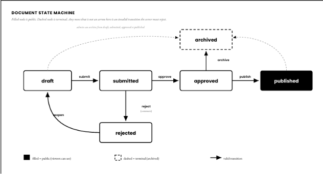

# PRD — Controlled Document Approval System
### ElevateBox Engineering Challenge · One-day scoped build

## 1. Overview

A small internal tool where documents move through a controlled approval workflow: **draft → submitted → approved → published**, with **rejected** and **archived** as side states. The system exists to prove two things, and everything else is secondary:

1. A document can never change state through an invalid transition, or through the wrong user.
2. Every state change is captured in an audit log, atomically, with the state change itself.

**Stack:** Node.js + Express + Postgres + Drizzle ORM, React frontend. Postgres/Drizzle is the brief's own "preferred" DB layer — going with it directly gives real transactions, a unique constraint on `(document_id, version)` where useful, and a schema evaluators will recognize immediately. *(Assuming Drizzle over Prisma/raw SQL since it's the tool the brief names as preferred — say if you'd rather use Prisma.)*

**Auth:** Seeded users, fake session via a simple cookie/header carrying a user ID. No real auth flow.

---

## 2. Roles & Permissions

| Role | Can do |
|---|---|
| `viewer` | View published documents only |
| `author` | Create documents; edit own draft/rejected docs; submit own docs |
| `reviewer` | View submitted docs; approve/reject (not own docs); publish approved docs |
| `admin` | Everything a reviewer can do for publishing; archive any document |

**Seeded users:**

| Email | Role |
|---|---|
| alice@example.com | author |
| bob@example.com | reviewer |
| admin@example.com | admin |
| viewer@example.com | viewer |

---

## 3. Document State Machine

*Filled node is public (viewers can see). Dashed node is terminal (archived). Any move that is not an arrow here is an invalid transition the server must reject. Admin can archive from draft, submitted, approved, or published.*

| From | To | Action | Who |
|---|---|---|---|
| draft | submitted | submit | owner (author) |
| submitted | approved | approve | reviewer, not the owner |
| submitted | rejected | reject (comment required) | reviewer, not the owner |
| rejected | draft | reopen | owner (author) |
| approved | published | publish | reviewer or admin |
| draft / submitted / approved / published | archived | archive | admin |

**Rule:** every transition is validated against this table server-side, in one place. Any (state, action) pair not in the table is rejected — no exceptions, no silent no-ops.

---

## 4. Data Models

**User** *(seeded, not user-managed)*
- `id`, `email`, `name`, `role`

**Document**
- `id`
- `title` *(required, non-empty)*
- `body` *(required, non-empty)*
- `status` — enum: draft / submitted / approved / rejected / published / archived
- `authorId` — owner, immutable after creation
- `version` — integer, incremented on every write, used for optimistic concurrency
- `rejectionComment` — set on reject, cleared on reopen
- `createdAt`, `updatedAt`

**AuditLog**
- `id`
- `documentId`
- `actorId`
- `action` — created / edited / submitted / approved / rejected / reopened / published / archived
- `fromStatus`, `toStatus` *(null for `edited`/`created`)*
- `comment` *(nullable — populated for rejections)*
- `timestamp`

---

## 5. API Endpoints

| Method | Path | Role | Notes |
|---|---|---|---|
| GET | /api/documents | any authenticated | scoped by role: viewer→published only, author→own+published, reviewer→submitted+published+own, admin→all |
| GET | /api/documents/:id | any authenticated | 403/404 if not visible to caller |
| GET | /api/documents/:id/history | any authenticated with doc access | returns AuditLog entries |
| POST | /api/documents | author | create draft |
| PATCH | /api/documents/:id | author (owner) | edit; only allowed when status is draft or rejected |
| POST | /api/documents/:id/submit | author (owner) | draft → submitted |
| POST | /api/documents/:id/approve | reviewer, not owner | submitted → approved |
| POST | /api/documents/:id/reject | reviewer, not owner | submitted → rejected, comment required |
| POST | /api/documents/:id/reopen | author (owner) | rejected → draft |
| POST | /api/documents/:id/publish | reviewer or admin | approved → published |
| POST | /api/documents/:id/archive | admin | any active state → archived |

All mutating endpoints accept `expectedVersion` in the body and reject with `409 Conflict` if it doesn't match the current stored version.

---

## 6. Non-Negotiable Invariants (checklist while building)

- [ ] Every private action checks auth server-side, not just hides a UI button
- [ ] Every transition goes through the single `transition(doc, action, user)` function — no endpoint mutates `status` directly
- [ ] Viewers can never fetch a non-published doc, including by guessing an ID
- [ ] Author can't approve/reject/publish their own document
- [ ] Reject always requires a non-empty comment
- [ ] Publish only allowed from `approved`
- [ ] Archived docs reject all further edits/transitions
- [ ] Status change + AuditLog write happen in one DB transaction — both or neither
- [ ] Stale `expectedVersion` on write → 409, not a silent overwrite

---

## 7. Concurrency Strategy

Every document carries a `version` integer. Every mutating request includes the version the client last saw. The update runs as `UPDATE documents SET ... WHERE id = $1 AND version = $2` — if zero rows are affected (because someone else already wrote a newer version), the write fails and the API returns 409 with a clear message. Client shows "this document changed — please refresh" rather than overwriting.

---

## 8. Build Order (today)

1. Seeded users + fake session middleware — *~1-2 hrs*
2. Document model + create draft (ownership + role check) — *~1 hr*
3. `transition()` function + transition table — *~1-2 hrs* (core of the challenge, build this by hand)
4. AuditLog wired into the same transaction as `transition()` — *~30-60 min*
5. Submit / approve / reject / publish endpoints, all calling `transition()` — *~1-2 hrs*
6. Version field + 409 conflict handling — *~30-60 min*
7. Archive — *if time remains*
8. Minimal UI (login-as, doc list, doc detail, action buttons, history view) — *remaining time*

---

## 9. Explicitly Out of Scope

*"Do not spend a single hour on any of these. They are explicitly out of scope."*

- [ ] Signup flow
- [ ] Password reset
- [ ] Email sending
- [ ] OAuth
- [ ] File upload
- [ ] Rich text editing
- [ ] Complex admin dashboard
- [ ] Real deployment
- [ ] Pixel-perfect styling
- [ ] Mobile-perfect layout

> Build something small, correct, and honest. We are reading for judgment.

---

## 10. DESIGN.md — Questions to Answer After Building

- What are the most important invariants in this system?
- Which are enforced by Postgres/schema constraints vs. application code?
- How do permissions work?
- How are stale/conflicting updates prevented?
- How is audit-log consistency guaranteed?
- What failure cases were considered?
- What would be improved with more time?
- What would need to change for real production use?
